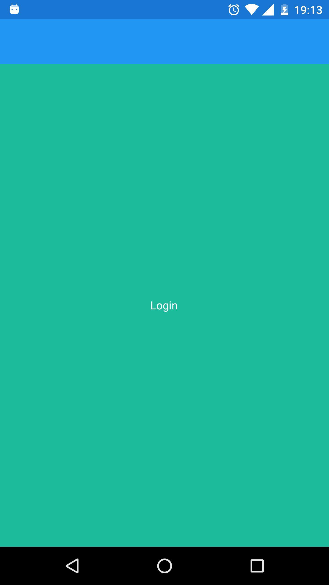
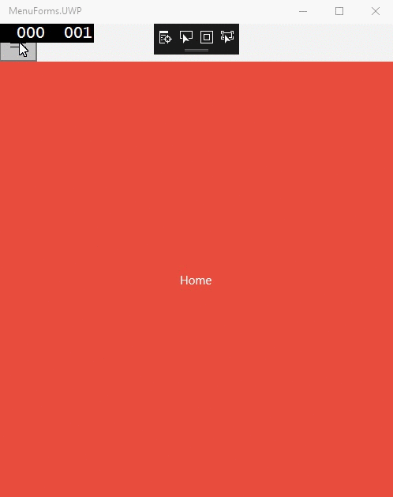

# Xamarin-Menu
MenuForms- Hamburger Menu Xamarin Form Framework
Xamarin menu can be considered as a Starter Kit helps you get started with Xamarin Forms. It contains a bunch of helpful boilerplate stuff - things like navigation, animation, services, and even a Hamburger control.

### Supported Platforms: iOS, Android, and Windows

## Requirements
* Windows 10
* [Visual Studio __2017__] (Upgraded from 2015 removed ~~MenuForms.WinPhone & MenuForms.Windows~~ folders)

## Screens
  ### 1) Login Screen


  ### 2) Home Screen
  **Android**


  **IOS**


  **UWP**



## Setup
**Download** or clone the repository.
**Rebuild** the solution to get all neccesary **NuGet** packages.

## Clean and Rebuild
If you see build issues when pulling updates from the repo, try cleaning and rebuilding the solution.

## Switching Screens
  Navigate to `Xamarin-Menu/MenuForms/MenuForms/DataServices/AuthenticationService.cs`<br/>
  For easier switching between Login and Home screen change the value of ```public bool IsAuthenticated => true;```<br/>
  Where `False -> Login` and `True -> Home`

  Once you are familiar with code you can remove `public bool IsAuthenticated => true;` and uncomment `public bool IsAuthenticated => !string.IsNullOrEmpty(Settings.AccessToken);`.<br/>
Now you just need to update **Settings.AccessToken** to true if you want logged in state to persist through out usage of app.

## Inspiration
This project has been greatly inspired by [Template10](https://github.com/Windows-XAML/Template10) & [BikeSharing](https://github.com/Microsoft/BikeSharing360_MobileApps)

Will be adding a Wiki documentation once I get time.<br/>
Till then **EAT, DRINK, CODE**.<br/>
Enjoy!

   


